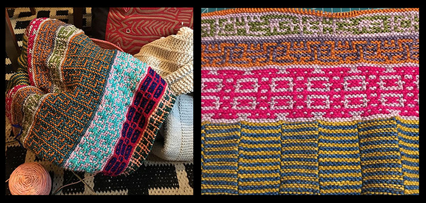

# Mosaic Knitting

  
This is a program written in python to generate and edit mosaic knitting patterns. It is currently designed to build an 8 stitch by 8(16) row block, displayed as a tessalation in real time.

Here's a decent link that explains [the mosaic knitting technique](https://www.interweave.com/article/knitting/tech-tip-mosaic-knitting/)

## Features:

Pattern validation (shows if your stitches are "legal")  
Generate a random (valid) block  
Real time tessalation: see your tiled pattern as you design your tile  
2-Color selection  
Save a block (contains both pattern and color information)  
Load a block from a file (folder of sample blocks included in the repo)  

## Future updates:

change the default block size to build bigger blocks  
load multiple blocks into one pattern, to build more complex/varied tesselations.   

## Libraries required:
tkinter - basic python UI library  
functools - part of standard distribution(s) of python  

## How to Run
Download all the files    
make sure you have tkinter, or download/install it and make sure its in your import path  
run main.py  

